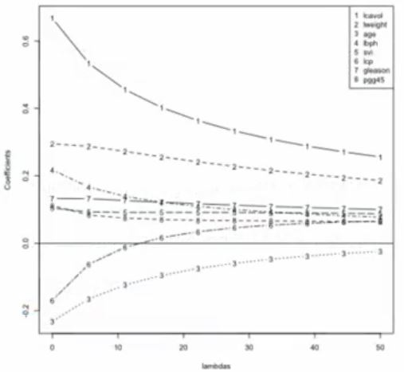

----------------


We learned about linear regression and generalized linear regression previously. For the basic idea here is to fit one of these regression models; And then, penalize or shrink the large coefficients corresponding with some of the predictor variables. 

The reason why we might do this is because it might help with the bias variance tradeoff. 

*  If certain variables are highly coordinated with each other, for example, you might not want to include them both in the linear regression model as they will have a very high variance. 
* But leaving one of them out might slightly bias your model. 

In other words, you might lose a little bit of prediction capability, but you'll save a lot on the variance and therefore improve your prediction to error. It can also help with model selection, in certain cases for regular organization techniques like the lasso. 


## Basic idea

1. Fit a regression model
2. Penalize (or shrink) large coefficients

__Pros:__

* Can help with the bias/variance tradeoff
* Can help with model selection

__Cons:__

* May be computationally demanding on large data sets
* Does not perform as well as random forests and boosting


---

## A motivating example

$$Y = \beta_0 + \beta_1 X_1 + \beta_2 X_2 + \epsilon$$

where $X_1$ and $X_2$ are nearly perfectly correlated (co-linear). You can approximate this model by:

$$Y = \beta_0 + (\beta_1 + \beta_2)X_1 + \epsilon$$

The result is:

* You will get a good estimate of $Y$
* The estimate (of $Y$) will be biased 
* We may reduce variance in the estimate

---

## Prostate cancer 

```{r prostate}
library(ElemStatLearn); data(prostate)
str(prostate)
```

Ye want a prediction abour PSA, based on a large number of predictors in the dataset.


This is a very typical of what happens when you build these models in practice. So suppose we predict with all possible combinations of predictor variables. We go to the linear regression model. For the outcome where we build one regression model for every possible combination of vectors. Then we can see as the number of predictors increases from left to right here, the training set error always goes down. (It has to down). \
As you include more predictors, the training set error will always decrease. But the test set data error, on the other hand, as the number of predictors increases, tgoes down, which is good, but then eventually it hits a plateau, and it starts to go back up again. \
This is because we're overfitting the data in the training set, and eventually, we may not want to include so many predictors in our model. 


## Model selection approach: split samples

So the idea is divide your data into training, test, and validation sets. You treat the validation set as the test data and you train every possible competing model  on the training data. And pick the one that works best on the validation data set. 

But now that we've used the validation set for training, we need to assess the error rate on a completely independent set. So we appropriately assess this performance by applying our prediction to the new data in the test set. 


* No method better when data/computation time permits it

* Approach
  1. Divide data into training/test/validation
  2. Treat validation as test data, train all competing models on the train data and pick the best one on validation. 
  3. To appropriately assess performance on new data apply to test set
  4. You may re-split and reperform steps 1-3

* Two common problems
  * Limited data (Here we're breaking the data set up into three different data sets. It might not be possible to get a very good model fit when we split the data that finely)
  * Computational complexity (If you're trying all possible subsets of models it can be very complicated, especially if you have a lot of predictor variables.)
  
http://www.biostat.jhsph.edu/~ririzarr/Teaching/649/
http://www.cbcb.umd.edu/~hcorrada/PracticalML/


## Decomposing expected prediction error

So another approach is to try to decompose the prediction error and see if there's another way that we can get at including only the variables that need to be included in the model. So if we assume that the variable y can be predicted as a function of x, plus some error term,. 
$$Y_i = f(X_i) + \epsilon_i$$

Then the expected prediction error is the expected difference between the outcome and the prediction of the outcome, squared:

$$EPE(\lambda) = E\left[\{Y - \hat{f}_{\lambda}(X)\}^2\right]$$

Suppose:$\hat{f}_{\lambda}$ is the estimate from the training data and look at a new data point $X = x^*$

Then if we look at a new point. So we bring in a new data point $X=x_0$ and we look at the distance between our our observed outcome and the prediction on the new data point $\hat{f}_{\lambda}(x^*)$ (f-hat lambda here is the estimate from the training set, using a particular set of tuning parameters lambda) . 

That can be decomposed after some algebra into : 

$$E\left[\{Y - \hat{f}_{\lambda}(x^*)\}^2\right] = \sigma^2 + \{E[\hat{f}_{\lambda}(x^*)] - f(x^*)\}^2 + var[\hat{f}_\lambda(x_0)]$$

<center> = Irreducible error + Bias$^2$ + Variance </center>

So the goal, whenever you're building a prediction model, is to reduce this overall quantity: Mean squared error between our our outcome and our prediction. 
The irreducible error can't usually be reduced. It's value that's just part of the data you're collecting. But you can trade off bias and variance. And that's what the idea behind regularized regression does. 


http://www.biostat.jhsph.edu/~ririzarr/Teaching/649/
http://www.cbcb.umd.edu/~hcorrada/PracticalML/


## Another issue for high-dimensional data

 I'm just showing you here a simple example of what happens when you have a lot of predictors. 
 
So here imagine that I only had five observations in my training set. It has more than five predictor variables. So I fit a linear model relating the outcome to all of these predictor variables. And there are more than five. Then some of them will get estimates. But some of them will be NA. In other words, r won't be able to estimate them because you have more predictors than you have samples. And, so you have, design matrix that cannot be inverted. 


```{r ,dependson="prostate"}
small = prostate[1:5,]
lm(lpsa ~ .,data =small)
```

http://www.biostat.jhsph.edu/~ririzarr/Teaching/649/
http://www.cbcb.umd.edu/~hcorrada/PracticalML/

---

## Hard thresholding

So here we have one approach to dealing with this problem is we can, and the other problem of trying to select our model. Is we could take this model that we have, and assume that it has a linear form, like this. 

* Model $Y = f(X) + \epsilon$

* Set $\hat{f}_{\lambda}(x) = x'\beta$


(So assume that it's a linear regression model). 

And then constrain only  lambda of the coefficients to be non-zero. so suppose there are only three non-zero coefficients. Then we have to try all the possible combinations of three coefficients that are non-zero, and then fit the best model. So that's still computationally quite demanding: 

* Constrain only $\lambda$ coefficients to be nonzero. 

* Selection problem is after chosing $\lambda$ figure out which $p - \lambda$ coefficients to make nonzero


 

So another approach is to use regularized regression.

## Regularization for regression

If the beta_j, the coefficients that we're fitting in the linear model, are unconstrained, (In other words, we don't claim that they have any particular form), They may "explode" if you have very highly correlated variables that you're using for prediction. And so, they can be susceptible to high variance. And the high variance means that you'll get predictions that aren't as accurate. 


If the $\beta_j$'s are unconstrained:
* They can explode
* And hence are susceptible to very high variance


To control variance, we might regularize/shrink the coefficients. 

$$PRSS(\beta) = \sum_{j=1}^n (Y_j - \sum_{i=1}^m \beta_{1i} X_{ij})^2 + P(\lambda; \beta)$$

where $PRSS$ is a "penalized" form of the sum of squares. 

So, remember that what we might want to minimize is some kind of distance between our outcome that we have and our linear model. So here, this is the distance between the outcome$Y_j$ and the linear model fit $\sum_{i=1}^m \beta_{1i} X_{ij}$ , squared. 
(That's the residual sum of squares); Then you might also add a penalty term $P(\lambda; \beta)$ here. That (the penalty) will basically say: if the beta coefficients are too big, it will shrink them back down. (??)


Things that are commonly looked for

* Penalty reduces complexity
* Penalty reduces variance
* Penalty respects structure of the problem


  So the idea here is that the inclusion of this lambda coefficient may also even make the problem non-singular. Even when the x transpose x is not invertible. 


## Ridge regression
The first approach that was used in this sort of penalized regression is to fit the regression model

Here again, we're penalizing a distance between our outcome $Y_j$ and our regression model $\sum_{i=1}^m \beta_{1i} X_{ij}$ , squared. And then we also have a term here $\lambda \sum_{j=1}^p \beta_j^2$.

Solve:

$$ \sum_{i=1}^N \left(y_i - \beta_0 + \sum_{j=1}^p x_{ij}\beta_j \right)^2 + \lambda \sum_{j=1}^p \beta_j^2$$
 So, what does this mean? If the beta j's squares are really big then this term will get too big, so we'll get, we won't get a very good fit. This whole quantity will end up being very big, so it basically requires that some of the beta j's be small.


Solving this problem is equivalent to  solving this problem where we're looking for the smallest sum of squared here and sum of squared differences here, Subject to a particular constraint that, the sum of squared beta j's is less than s.

$\sum_{i=1}^N \left(y_i - \beta_0 + \sum_{j=1}^p x_{ij}\beta_j \right)^2$ subject to $\sum_{j=1}^p \beta_j^2 \leq s$ where $s$ is inversely proportional to $\lambda$ 


Inclusion of $\lambda$ may make the problem non-singular even if $X^TX$ is not invertible. In other words, in that model fit where we have more predictors than, observations the ridge regression model can still be fit. 

http://www.biostat.jhsph.edu/~ririzarr/Teaching/649/
http://www.cbcb.umd.edu/~hcorrada/PracticalML/


---

## Ridge coefficient paths

{width=2.5in height=2in}

as lambda increases, we penalize the big betas more and more. So we start off with the betas being equal to a certain of values here on the left when lambda's equal to 0. That's just a standard linear with regression values. And as you increase lambda, all of the coefficients get closer to 0, because we're penalizing the coefficients, and make, and making them smaller. 
So the tuning parameter lambda controls the size of the coefficients. 


http://www.biostat.jhsph.edu/~ririzarr/Teaching/649/
http://www.cbcb.umd.edu/~hcorrada/PracticalML/

---

## Tuning parameter $\lambda$

* $\lambda$ controls the size of the coefficients
* $\lambda$ controls the amount of *regularization*
* As $\lambda \rightarrow 0$ we obtain the least square solution
* As $\lambda \rightarrow \infty$ we have $\hat{\beta}_{\lambda=\infty}^{ridge} = 0$

So taking that parameter can be done with cross-validation or other techniques to try to pick the optimal tuning parameter. That trades off bias for variance. 


## Lasso 

A similar approach can be done with a slight change of penalty. 

Minimize:

$$\sum_{i=1}^N \left(y_i - \beta_0 + \sum_{j=1}^p x_{ij}\beta_j \right)^2$$ 
subject to 
$$\sum_{j=1}^p |\beta_j| \leq s$$ 

The problem also has a lagrangian form 

$$ \sum_{i=1}^N \left(y_i - \beta_0 + \sum_{j=1}^p x_{ij}\beta_j \right)^2 + \lambda \sum_{j=1}^p |\beta_j|$$

For orthonormal design matrices (not the norm!) this has a closed form solution

$$\hat{\beta}_j = sign(\hat{\beta}_j^0)(|\hat{\beta}_j^0 - \gamma)^{+}$$
(but not in general). 
And the closed form solution is basically: take the absolute value of the beta j and subtract off a gamma value. And take only the positive part. In other words if gamma is bigger than your least squared beta hat j then this will be a negative number. And you're taking only the positive part so you set it equal to 0. So if it's a positive though if this absolute beta hat j is bigger than, the gamma value. Then this whole number will be a smaller positive number. It will be shrunk by the amount gamma. And then, we multiply it by the sign of the original coefficient. So what is this doing? Its basically saying the lasso shrinks all of the coefficients and set some of them to exactly 0. And some people like this approach because it both shrinks coefficients. And by setting something exactly to 0 it performs model selection for you in advance. 


http://www.biostat.jhsph.edu/~ririzarr/Teaching/649/
http://www.cbcb.umd.edu/~hcorrada/PracticalML/


---

## Notes and further reading


* [Hector Corrada Bravo's Practical Machine Learning lecture notes](http://www.cbcb.umd.edu/~hcorrada/PracticalML/)
* [Hector's penalized regression reading list](http://www.cbcb.umd.edu/~hcorrada/AMSC689.html#readings)
* [Elements of Statistical Learning](http://statweb.stanford.edu/~tibs/ElemStatLearn/)
* In `caret` methods are:
  * `ridge`
  * `lasso`
  * `relaxo`


http://www.biostat.jhsph.edu/~ririzarr/Teaching/649/
http://www.cbcb.umd.edu/~hcorrada/PracticalML/


