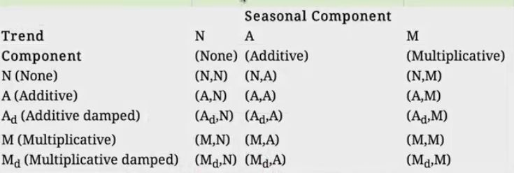

********************************
```{r libs, warning=FALSE}
# added
# install.packages('forecast', dependencies = TRUE)
library(forecast)
library(quantmod) # data
dataweb = FALSE # get data from the web if TRUE, else from saved file "GOOG"

```


```{r setup, include=FALSE}
knitr::opts_chunk$set(echo = TRUE, fig.show = "hold", fig.width = 3.5, fig.asp = 1, fig.align = "center")
```

# Intro : What is different? {#sec:intro}

* Data are dependent over time
* Specific pattern types
    * Trends - long term increase or decrease
    * Seasonal patterns - patterns related to time of week, month, year, etc.
    * Cycles - patterns that rise and fall periodically
* Subsampling into training/test is more complicated
* Similar issues arise in spatial data 
    * Dependency between nearby observations
    * Location specific effects
* Typically goal is to predict one or more observations into the future. 
* All standard predictions can be used (with caution!)

---

# Beware! {#sec:beware}

## Beware spurious correlations!


[http://www.google.com/trends/correlate](http://www.google.com/trends/correlate)

[http://www.newscientist.com/blogs/onepercent/2011/05/google-correlate-passes-our-we.html](http://www.newscientist.com/blogs/onepercent/2011/05/google-correlate-passes-our-we.html)

## Also common in geographic analyses

[http://xkcd.com/1138/](http://xkcd.com/1138/)


## Beware extrapolation!

[http://www.nature.com/nature/journal/v431/n7008/full/431525a.html](http://www.nature.com/nature/journal/v431/n7008/full/431525a.html)


## Google data


```{r getGOOG}
if (dataweb) {
        # get data from web
        from.dat <- as.Date("01/01/08", format="%m/%d/%y")
        to.dat <- as.Date("12/31/13", format="%m/%d/%y")
        getSymbols("GOOG", from = from.dat, to = to.dat) # get data from google finance dataset 
        # omit src="google"
        
        # Save GOOG
        save(GOOG,file = "GOOG")
        
} else { # read GOOG
        load(file = "GOOG")  
}


```

```{r transformGOOG}
# transform
mGoog <- to.monthly(GOOG) # convert to monthly series
googOpen <- Op(mGoog) # extract the "opening" info
ts1 <- ts(googOpen,frequency=12) # create a time series object with ts()
plot(ts1, xlab="Years+1", ylab="GOOG")
```


# Time series decomposition ( Example )

* __Trend__  - Consistently increasing pattern over time 
* __Seasonal__ -  When there is a pattern over a fixed period of time that recurs.
* __Cyclic__ -  When data rises and falls over non fixed periods

[https://www.otexts.org/fpp/6/1](https://www.otexts.org/fpp/6/1)


## Decompose a time series into parts

Decompose () and plot components

```{r ,dependson="tseries",fig.height=4.5,fig.width=4.5}
# windows()
curpar <- par("mfrow")
par(mfrow=c(1,2))
plot(decompose(ts1, type = "additive" ),xlab="Years+1")
Sys.sleep(10)
plot(decompose(ts1, type = "multiplicative" ),xlab="Years+1")
Sys.sleep(10)
par(mfrow = curpar)
# dev.off()
```

---

## Training and test sets

```{r trainingTest,dependson="tseries",fig.height=4.5,fig.width=4.5}
ts1Train <- window(ts1,start=1,end=5)
ts1Test <- window(ts1,start=5,end=(7-0.01))
ts1Train
```

---

## Simple moving average

$$ Y_{t}=\frac{1}{2*k+1}\sum_{j=-k}^k {y_{t+j}}$$

```{r ,dependson="trainingTest",fig.height=4.5,fig.width=4.5}

# auxiliary
# is.even <- function(n){n %/% 2 == n/2}
# 
# # moving average def
# ma <- function(x,order=5){
#         n <- order
#         if (!is.even(n)) {
#                 stats::filter(x,rep(1/n,n), sides=2)
#         }else { stats::filter(x,
#                               c( 1/ (2*n), rep(1/n,n - 1), 1/ (2*n)),
#                               sides=2)} # bogus
# }
# unnecessary: package "forecasting"

plot(ts1Train)
lines(ma(ts1Train,order=3),col="red")

```


---

## Exponential smoothing

__Example - simple exponential smoothing__
$$\hat{y}_{t+1} = \alpha y_t + (1-\alpha)\hat{y}_{t-1}$$



[https://www.otexts.org/fpp/7/6](https://www.otexts.org/fpp/7/6)

---

## Exponential smoothing

```{r ets,dependson="trainingTest",fig.height=4.5,fig.width=4.5}
ets1 <- ets(ts1Train,model="MMM")
fcast <- forecast(ets1)
plot(fcast); lines(ts1Test,col="red")
```


---

## Get the accuracy

```{r ,dependson="ets",fig.height=4.5,fig.width=4.5}
accuracy(fcast,ts1Test)
```

