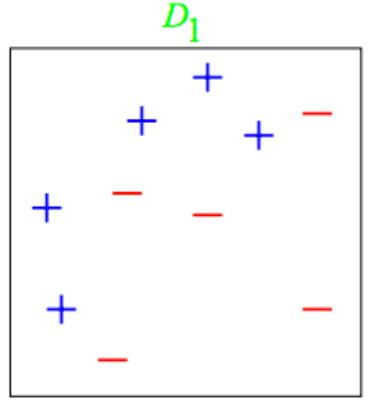
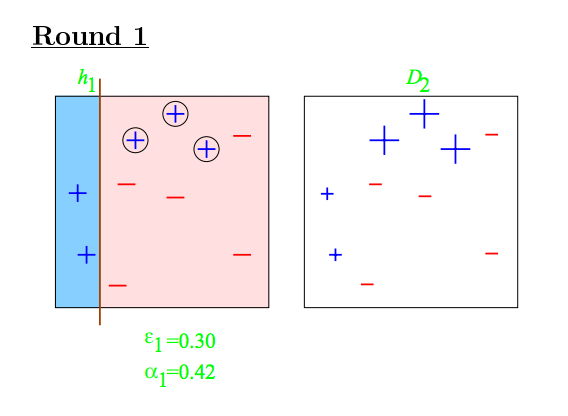
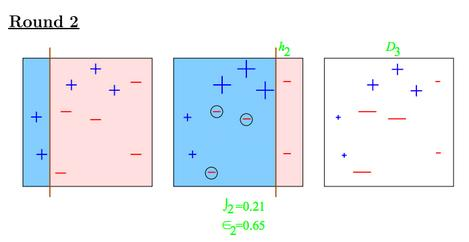
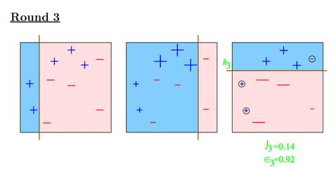
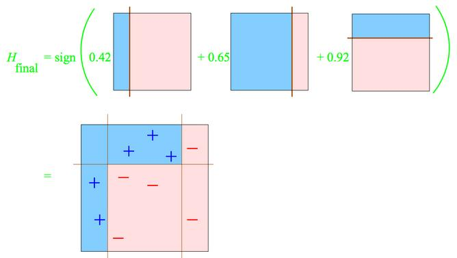

----------------


```{r setup, cache = FALSE, echo = FALSE, message = FALSE, warning = FALSE, tidy = FALSE}

library(knitr)
options(width = 100)
opts_chunk$set(message = F, error = F, warning = F, fig.align = 'center')

```

```{r libs,include=FALSE}
library(caret)
library(ggplot2)
library(grid)
library(gridExtra)
library(randomForest)

```

# Install first

gbm, ISLR, 


# Basic idea

1. Take lots of (possibly) weak predictors
2. Weight them and add them up
3. Get a stronger predictor


---

## Basic procedure

1. Start with a set of classifiers $h_1,\ldots,h_k$
  * Examples: All possible trees, all possible regression models, all possible cutoffs.
  
2. Create a classifier that combines classification functions: 
$$f(x) = \rm{sgn}\left(\sum_{t=1}^T \alpha_t h_t(x)\right)$$.
  * Goal is to minimize error (on training set)
  * Iterative, select one $h$ at each step
  * Calculate weights based on errors
  * Upweight missed classifications and select next $h$
  
  __See__
  
[Adaboost on Wikipedia](http://en.wikipedia.org/wiki/AdaBoost) == most famous boost algorithm

[http://webee.technion.ac.il/people/rmeir/BoostingTutorial.pdf](http://webee.technion.ac.il/people/rmeir/BoostingTutorial.pdf) == nice tutorial on boosting


# Simple example

2 features x1,x2 , outcome = y = +1 or -1



training set $\{...(x_i , y_i)...\} \mathrm {\quad with \quad} y_i = \pm 1, \mathrm {\quad and \quad} i=1...m$
y is to be predicted.


## Round 1: adaboost




Distribution 1: $D_1(i)= \frac {1}{m}$
$$\epsilon_1 = Pr_{D_1}(misclassification)$$
$$\alpha_1 = \frac {1} {2} \cdot ln(\frac {1-\epsilon_1} {\epsilon_1}) $$

so: 
$\epsilon_1 = 0.30$ , $\alpha_1 = 0.42$


etape suivante: distribution $D_{t+1}$

$$D_{t+1}(i) = \frac {1} {Z_t} \cdot D_{t}(i) \cdot e^{-\alpha_t} \mathrm{\quad if\; i\; classified \; ok} $$
$$D_{t+1}(i) = \frac {1} {Z_t} \cdot D_{t}(i) \cdot e^{\alpha_t} \mathrm{\quad if\; i\; is \; misclassified} $$


## Round 2 & 3



$$\epsilon_2 = Pr_{D_2}(misclassification) = 0.21$$ ,

$$\alpha_2 = \frac {1} {2} \cdot ln(\frac {1-\epsilon_2} {\epsilon_2}) = 0.65$$




$$\epsilon_3 = Pr_{D_2}(misclassification) = 0.14$$
$$\alpha_3 = \frac {1} {2} \cdot ln(\frac {1-\epsilon_3} {\epsilon_3}) = 0.92$$


## Complete classifier

$$H_{final}(i) = \alpha_1 \cdot h_1(i) + \alpha_2 \cdot h_2(i) + \alpha_3 \cdot h_3(i)$$




sources:

[http://webee.technion.ac.il/people/rmeir/BoostingTutorial.pdf](http://webee.technion.ac.il/people/rmeir/BoostingTutorial.pdf)

[http://www.di.unipi.it/~cardillo/AA0304/fabio/boosting.pdf](http://www.di.unipi.it/~cardillo/AA0304/fabio/boosting.pdf) page 8 (Schapire & Singer)


---

# Boosting in R 

* Boosting can be used with any subset of classifiers
* One large subclass is [gradient boosting](http://en.wikipedia.org/wiki/Gradient_boosting)
* R has multiple boosting libraries. Differences include the choice of basic classification functions and combination rules.
  * [gbm](http://cran.r-project.org/web/packages/gbm/index.html) - boosting with trees.
  * [mboost](http://cran.r-project.org/web/packages/mboost/index.html) - model based boosting
  * [ada](http://cran.r-project.org/web/packages/ada/index.html) - statistical boosting based on [additive logistic regression](http://projecteuclid.org/DPubS?service=UI&version=1.0&verb=Display&handle=euclid.aos/1016218223)
  * [gamBoost](http://cran.r-project.org/web/packages/GAMBoost/index.html) for boosting generalized additive models
* Most of these are available in the caret package 


## Wage example

```{r wage, cache=TRUE}
library(ggplot2)
library(caret)
library(ISLR)

data(Wage)

Wage <- subset(Wage,select=-c(logwage)) # remove  "logwage" from the set of predictors ?
inTrain <- createDataPartition(y=Wage$wage,
                              p=0.7, list=FALSE)
training <- Wage[inTrain,]; testing <- Wage[-inTrain,]
```


### Fit the model

with the package gbm (boosting trees) through caret

```{r, dependson="wage", cache=TRUE}
modFit <- train(wage ~ ., method="gbm", data=training, verbose=FALSE)
print(modFit)
```


### Plot prediction/truth

```{r, dependson="wage", fig.height=4,fig.width=4}
qplot(predict(modFit,testing),wage,data=testing)
```


---

## Notes and further reading

* A couple of nice tutorials for boosting
  * Freund and Shapire - [http://www.cc.gatech.edu/~thad/6601-gradAI-fall2013/boosting.pdf](http://www.cc.gatech.edu/~thad/6601-gradAI-fall2013/boosting.pdf)
  * Ron Meir- [http://webee.technion.ac.il/people/rmeir/BoostingTutorial.pdf](http://webee.technion.ac.il/people/rmeir/BoostingTutorial.pdf)
* Boosting, random forests, and model ensembling are the most common tools that win Kaggle and other prediction contests. 
  * [http://www.netflixprize.com/assets/GrandPrize2009_BPC_BigChaos.pdf](http://www.netflixprize.com/assets/GrandPrize2009_BPC_BigChaos.pdf)
  * [https://kaggle2.blob.core.windows.net/wiki-files/327/09ccf652-8c1c-4a3d-b979-ce2369c985e4/Willem%20Mestrom%20-%20Milestone%201%20Description%20V2%202.pdf](https://kaggle2.blob.core.windows.net/wiki-files/327/09ccf652-8c1c-4a3d-b979-ce2369c985e4/Willem%20Mestrom%20-%20Milestone%201%20Description%20V2%202.pdf)
  


