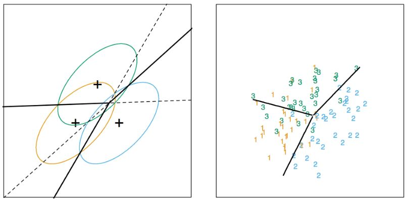

----------------


```{r setup, cache = FALSE, echo = FALSE, message = FALSE, warning = FALSE, tidy = FALSE}

library(knitr)
options(width = 100)
opts_chunk$set(message = F, error = F, warning = F, fig.align = 'center')

```

```{r libs,include=FALSE}
library(caret)
library(ggplot2)
library(grid)
library(gridExtra)

# auxiliary code
# ---------------

# palette color-blind-friendly: The palette with black
cbbPalette <- c("#000000", "#E69F00", "#56B4E9", "#009E73",
                "#F0E442", "#0072B2", "#D55E00", "#CC79A7")


# modified BFC

cbfPalette <- cbbPalette
cbfPalette[3] <- cbbPalette[7]
cbfPalette[6] <- cbbPalette[3]
cbfPalette[8] <- cbbPalette[7]

# * `set_default_scale` has been removed. If you want to change the default
# scale for an aesthetic, just create a function called
# `scale_aesthetic_continuous` or `scale_aesthetic_discrete` that returns the
# scale that you want.  For example:

p <- qplot(mpg, wt, data = mtcars, colour = factor(cyl))

# scale_colour_discrete <- scale_colour_brewer
scale_colour_discrete <- function(...) {
        scale_colour_manual(values = cbbPalette)
}

# scale_colour_discrete <- scale_colour_brewer
scale_fill_discrete <- function(...) {
        scale_fill_manual(values = cbbPalette)
}


scale_colour_continuous <- function(...) {
        ggplot2::scale_colour_gradient(
                low = "#009900", high = "#FF0000")
}


```


# Install first
klaR


## Basic idea

1. Assume the data follow a probabilistic model
2. Use Bayes' theorem to identify optimal classifiers

__Pros:__

* Can take advantage of structure of the data
* May be computationally convenient
* Are reasonably accurate on real problems

__Cons:__

* Make additional assumptions about the data
* When the model is incorrect you may get reduced accuracy

---


# Model based approach


1. Our goal is to build a parametric model for conditional distribution $P(Y = k  \;  |  \;  X = x)$

2. A typical approach is to apply [Bayes theorem](http://en.wikipedia.org/wiki/Bayes'_theorem):
$$ Pr(Y = k \; | \; X=x) = \frac {Pr(X=x \; | \; Y=k)  \cdot Pr(Y=k)} {\sum_{\ell=1}^K Pr(X=x \; | \; Y = \ell)  \cdot Pr(Y=\ell)}$$
$$Pr(Y = k | X=x) = \frac {f_k(x) \cdot \pi_k}{\sum_{\ell = 1}^K f_{\ell}(x) \cdot  \pi_{\ell}}$$

3. Typically prior probabilities $\pi_k$ are set in advance.

4. A common choice for $f_k(x) = \frac{1}{\sigma_k \sqrt{2 \pi}}e^{-\frac{(x-\mu_k)^2}{\sigma_k^2}}$, a Gaussian distribution

5. Estimate the parameters ($\mu_k$,$\sigma_k^2$) from the data.

6. Classify to the class with the highest value of $P(Y = k | X = x)$


# Classifying using the model

A range of models use this approach

* Linear discriminant analysis assumes $f_k(x)$ is multivariate Gaussian with same covariances
* Quadratic discrimant analysis assumes $f_k(x)$ is multivariate Gaussian with different covariances
* [Model based prediction](http://www.stat.washington.edu/mclust/) assumes more complicated versions for the covariance matrix 
* Naive Bayes assumes independence between features for model building

__More technical details__: http://statweb.stanford.edu/~tibs/ElemStatLearn/


---

## Linear Discriminant Dnalysis

__Why linear discriminant analysis?__

We consider the ratio of the probabilities of the two classes and we take the log of that quantity

$$log \frac{Pr(Y = k \; | \; X=x)}{Pr(Y = j \; | X=x)}$$


$$ = log \frac{f_k(x)}{f_j(x)} + log \frac{\pi_k}{\pi_j}$$
Now these terms are actually require more writing so can write them out and we end up with this: 

$$ = log \frac{\pi_k}{\pi_j} - \frac{1}{2}(\mu_k + \mu_j)^T \, \Sigma^{-1} \, (\mu_k + \mu_j) + x^T  \, \Sigma^{-1}  \, (\mu_k - \mu_j)$$
We get : 

* the log of the [UNKNOWN] ratio of the prior probabilities 
* Plus a term here that depends on the parameters of our Gaussian distributions for each class. 
* Plus a linear term, so this the x variable here times one fixed coefficient, which is a linear terms 

So you end up getting basically lines that are drawn through the data. And a variable will have a higher probability of one class if it's on one side of the line and a higher probability of being in another class if it's on the other side of the line.


($\Sigma$ = covariance matrix).


(__More__ http://statweb.stanford.edu/~tibs/ElemStatLearn/)

So this is what the decision boundaries tend to look like, for these sort of prediction models.




So this basically is how it works. You fit Gaussian distributions to the data and then use those Gaussian distributions to draw lines that assign the prop points to the highest posterior probabilities. 


## Discriminant function

$$\delta_k(x) = x^T \, \Sigma^{-1} \, \mu_k - \frac{1}{2}\mu_k \, \Sigma^{-1} \, \mu_k + log(\mu_k)$$


* Decide on class based on $\hat{Y}(x) = argmax_k \delta_k(x)$ :
Basically what we do is we plug in our new data value into this function and we pick the value of k that produces the largest value of this particular discriminant function. 

* We usually estimate parameters with maximum likelihood


## Naive Bayes

Suppose we have many predictors, we would want to model: $P(Y = k \; | \; X_1,\ldots,X_m)$

We could use Bayes Theorem to get:

$$P(Y = k | X_1,\ldots,X_m) = \frac{\pi_k P(X_1,\ldots,X_m| Y=k)}{\sum_{\ell = 1}^K P(X_1,\ldots,X_m | Y=k)  \ \pi_{\ell}}$$
Which is proportionnal to:
$$ \propto \pi_k \cdot P(X_1,\ldots,X_m \;| \; Y=k)$$
In other words, if you pick the largest value of the quantity $P(X_1,\ldots,X_m \ | \  Y=k)$, it will be the same as picking the largest probability in $\frac{\pi_k P(X_1,\ldots,X_m| Y=k)}{\sum_{\ell = 1}^K P(X_1,\ldots,X_m | Y=k)  \ \pi_{\ell}}$ Because the term in the denominator is just a constant for all the different probabilities.


This can be written:

$$P(X_1,\ldots,X_m, \, Y=k) = \pi_k \ P(X_1  \; | \; Y = k) \cdot P(X_2,\ldots,X_m  \; | \;  X_1, \, Y=k)$$
You can continue to break down in the same way until you get one term for every feature. But those features are always conditional on all the other variables that you, that have come before it. And so that's basically because each features may, or each of the predictors may be dependent on each other.
$$ = \pi_k P(X_1 \; | \; Y = k) \cdot P(X_2 \; | \; X_1, \, Y=k) P(X_3,\ldots,X_m  \; | \; X_1,X_2, Y=k)$$
$$ = \pi_k P(X_1  \;  |  \;  Y = k) \cdot P(X_2  \;  |  \;  X_1, Y=k)\ \ldots\ P(X_m \;  |  \; X_1\ldots,X_{m-1},Y=k)$$
One assumption you could make to make this quite a bit easier would be to just assume that all of the predictor variables are independent of each other. In which case they drop out of this conditioning argument. And you end up with the prior probability times the probability of each feature by itself conditional on being in each class: we write this:

$$ \approx \pi_k \cdot P(X_1  \  |  \  Y = k)  \cdot P(X_2  \  |  \  Y = k)  \cdot  \ldots  \cdot P(X_m  \  |  \ Y=k)$$

This is kind of a naive assumption because we're assuming that all the features are independent even though we know they're probably not. 

It still works reasonably well in a large number of applications. And it's particularly useful when you have a very large number of features that are binary or categorical variables. This very frequently comes up in Text classification and classification of other kind of document classification. 

---

# Example: Iris Data

## data
```{r iris, cache=TRUE}
data(iris)
library(ggplot2)

names(iris)
table(iris$Species)
```


## Create training and test sets

```{r trainingTest, dependson="iris",cache=TRUE}
set.seed(934)
inTrain <- createDataPartition(y=iris$Species,
                              p=0.7, list=FALSE)
training <- iris[inTrain,]
testing <- iris[-inTrain,]
dim(training); dim(testing)
```


## Build predictions with LDA and Naïve Bayes

```{r fit,dependson="trainingTest"}

# train models 
modlda = train(Species ~ .,data=training,method="lda")
modnb = train(Species ~ ., data=training,method="nb")

# predict
plda = predict(modlda,testing); 
pnb = predict(modnb,testing)

# compare predictions
table(plda,pnb)
```


We can see that the predictions agree for all but one value

## Visual comparison of results

```{r,dependson="fit",fig.height=4,fig.width=4}
equalPredictions = (plda==pnb)
qplot(Petal.Width,Sepal.Width,colour=equalPredictions,data=testing)
```

We can see that the predictions agree for all but one value. 

So even though we know that the features or the predictors are dependent here, using the naive based classification means very similar prediction rules to the linear discriminant analysis classification and so we can do a comparison of the results and we see that just this one value the value that appears right here between the two classes appears to be not classified in the same way by the two outputs but overall they perform very similarly. 


## Prediction checking (bfc)

```{r}
# LDA
predictlda <- predict(object = modlda, newdata = testing)
confusionMatrix(predictlda, testing$Species)
```


```{r}
# Naive Bayes
predictnb <- predict(object = modnb, newdata = testing)
confusionMatrix(predictlda, testing$Species)
```

---

# Notes and further reading

* [Introduction to statistical learning](http://www-bcf.usc.edu/~gareth/ISL/)
* [Elements of Statistical Learning](http://www-stat.stanford.edu/~tibs/ElemStatLearn/)
* [Model based clustering](http://www.stat.washington.edu/raftery/Research/PDF/fraley2002.pdf)
* [Linear Discriminant Analysis](http://en.wikipedia.org/wiki/Linear_discriminant_analysis)
* [Quadratic Discriminant Analysis](http://en.wikipedia.org/wiki/Quadratic_classifier)
